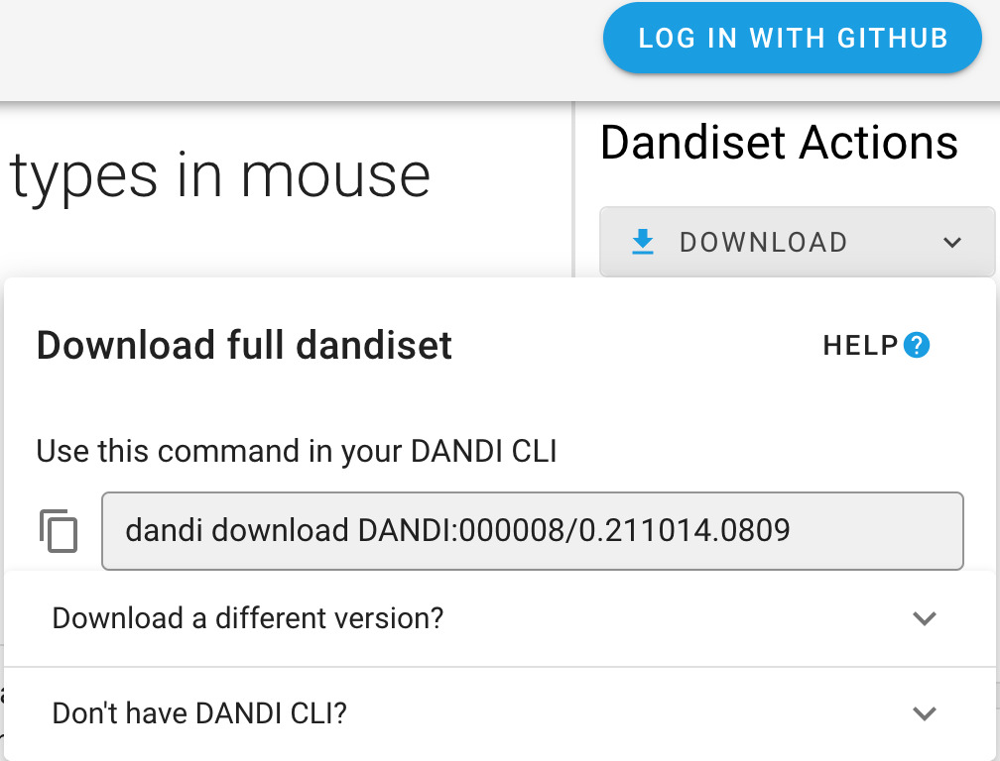
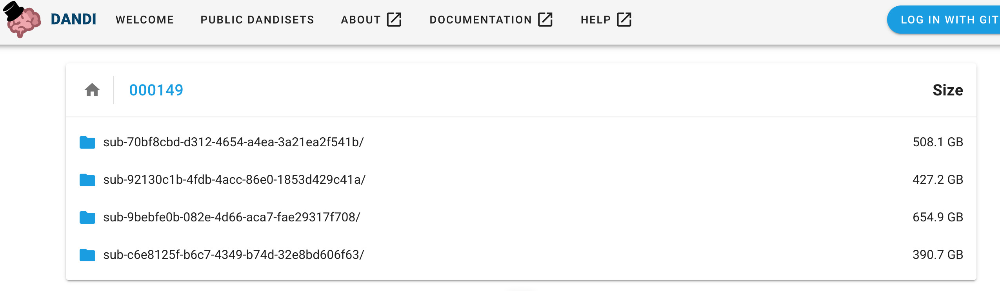
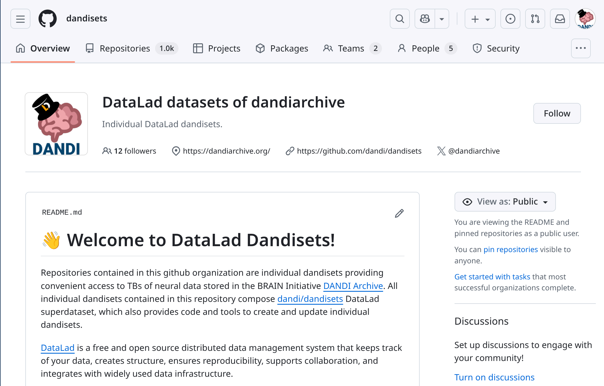

# Downloading Data

You can download the content of a Dandiset using the DANDI Web application (such a specific file) or entire
Dandisets using the DANDI Python CLI.

## Using the DANDI Web Application

Once you have the Dandiset you are interested in (see more in [Exploring Dandisets](../exploring-dandisets.md)), you can download the content of the Dandiset.
On the landing page of each Dandiset, you can find `Download` button on the right-hand panel. After clicking the
button, you will see the specific command you can use with DANDI Python CLI (as well as the information on how to download the CLI).




### Download specific files

The right-side panel of the Dandiset landing page allows you also to access the list of folders and files.




Each file in the Dandiset has a download icon next to it, clicking the icon will start the download process.


## Using the Python CLI Client

The [DANDI Python client](https://pypi.org/project/dandi/) gives you more options, such as downloading entire
Dandisets.

**Before You Begin**: You need to have Python 3.9+ and install the DANDI Python Client using `pip install dandi`.
If you have an issue using the DANDI Client, see the [DANDI Client docs](https://dandi.readthedocs.io).

### Download a Dandiset
To download an entire Dandiset, you can use the same command as suggested by DANDI web application, e.g.:

    dandi download DANDI:000023

### Download data for a specific subject from a Dandiset
You can download data for specific subjects.
Names of the subjects can be found on DANDI web application or by running a command with the DANDI CLI: `dandi ls -r
DANDI:000023`.
Once you have the subject ID, you can download the data, e.g.:

    dandi download "https://api.dandiarchive.org/api/dandisets/000023/versions/draft/assets/?path=sub-811677083"

You could replace `draft` with a specific non-draft version you are interested in (e.g. `0.210914.1900` in the case of this Dandiset), if you are not interested in the latest, possibly different state of the Dandiset.

You can also use the link from DANDI web application, e.g.:

    dandi download "https://dandiarchive.org/dandiset/000023/0.210914.1900/files?location=sub-541516760"


### Download a specific file from a Dandiset
You can download a specific file from a Dandiset when the link for the specific file can be found on the DANDI web
application, e.g.:

    dandi download https://api.dandiarchive.org/api/dandisets/000023/versions/0.210914.1900/assets/1a93dc97-327d-4f9c-992d-c2149e7810ae/download/


**Hint:** `dandi download` supports a number of [Resource Identifiers](https://dandi.readthedocs.io/en/latest/ref/urls.html#resource-ids) to point to a Dandiset, folder, or file.  Providing
an incorrect URL (e.g. `dandi download wrongurl`) will provide a list of supported identifiers.

### Download the `dandiset.yaml` file and a specific file within the directory tree of the Dandiset
Now available in version `0.63.0` is the `--preserve-tree` option.
In the command below, replace the `<dandiset-id>`, `<version>`, and asset `<path>`.
The `<path>` can be found by selecting the `View asset metadata` icon next to an asset on https://dandiarchive.org and locating the `path` key.

    dandi download --preserve-tree dandi://dandi/<dandiset-id>@<version>/<path>

For example:

    dandi download --preserve-tree dandi://dandi/000026@draft/sub-I58/ses-Hip-CT/micr/sub-I58_sample-01_chunk-01_hipCT.json

## Using DataLad

All dandisets are regularly mirrored to DataLad datasets which are made available at the GitHub organization https://github.com/dandisets.



Each Dandiset is represented as a separate DataLad dataset.
<https://github.com/dandi/dandisets/> is a [DataLad superdataset](https://handbook.datalad.org/en/latest/glossary.html#term-DataLad-superdataset) that includes all individual Dandiset datasets as subdatasets ([git submodules](https://git-scm.com/book/en/v2/Git-Tools-Submodules)).
Where present, individual [Zarr](https://zarr.dev/) assets are included as subdatasets ([git submodules](https://git-scm.com/book/en/v2/Git-Tools-Submodules)) hosted in the GitHub organization <https://github.com/dandizarrs/>.

The Git revision histories of each dataset reflect the Dandiset's draft state as of each execution of the mirroring job.
Published Dandiset versions are tagged with Git tags.

With DataLad, you can:

- clone an entire dataset,
- use a specific version of it,
- explore history of modifications,
- download content of files of interest,
- locally discard the content of no-longer-needed files,
- use the dataset in a reproducible manner,
- include it as a subdataset in your own DataLad dataset,
- use https://github.com/datalad/datalad-fuse/ to [FUSE](https://en.wikipedia.org/wiki/Filesystem_in_Userspace)-mount individual locally-cloned dandisets so that their files' contents are transparently streamed to your DANDI/DataLad-unaware tools,
- etc.

Learn more about DataLad from its handbook at <https://handbook.datalad.org/>.

**Developers' note:** DataLad datasets are created using the [dandi/backups2datalad](https://github.com/dandi/backups2datalad/) tool which is also available for use by the community to similarly maintain mirrors of independent DANDI deployments as DataLad datasets.

## Using WebDAV

DANDI provides a [WebDAV](https://en.wikipedia.org/wiki/WebDAV) service at https://webdav.dandiarchive.org/ for accessing the data in the DANDI archive.
You can use any WebDAV client or even a web browser to access the data - any Dandiset, any version, any file or collection of files, and navigate inside Zarr assets (including their versions).

You can use any web download tool to download the data from the DANDI archive, e.g.

````commandline
wget -r -np -nH --cut-dirs=3 https://webdav.dandiarchive.org/dandisets/000027/releases/0.210831.2033/
````

for a download of a specific release `0.210831.2033` of the `000027` dandiset.

**Note:** The WebDAV service does not directly serve any file contents; it instead relies on redirects to AWS S3 storage where the contents are stored.
You might need to configure your WebDAV client to follow redirects; e.g., for the [davfs2](https://savannah.nongnu.org/projects/davfs2) WebDAV client, set `follow_redirect` to `1` in `/etc/davfs2/davfs2.conf`.

**Developers' note:** The WebDAV service's code is available at https://github.com/dandi/dandidav/ and can also be used for independent DANDI deployments.


## Using S3 Directly

DANDI stores all asset content in the public AWS S3 bucket [`dandiarchive`](https://dandiarchive.s3.amazonaws.com/).
Any S3 client (e.g. `aws s3`, `rclone`) works, and individual objects are also reachable over plain HTTPS using URLs of the form `https://dandiarchive.s3.amazonaws.com/<key>` — no AWS account or authentication is required for non-embargoed data.

The bucket has three top-level folders relevant to data access:

- **`blobs/`** — content of individual (non-Zarr) assets, named by a hash-derived key (e.g. `blobs/58c/537/58c53789-eec4-4080-ad3b-207cf2a1cac9`).
- **`zarr/`** — content of [Zarr](https://zarr.dev/) assets, each laid out as the original Zarr directory tree under `zarr/<zarr-id>/`.
- **`dandisets/`** — per-Dandiset manifests that map each Dandiset version to the specific entries it contains under `blobs/` and `zarr/`.

Because `blobs/` and `zarr/` are keyed by content/identifier rather than by Dandiset path, you locate files by starting from `dandisets/`.

### Browsing the bucket via Quilt

[Quilt](https://open.quiltdata.com/b/dandiarchive/tree/README.md) offers a web UI for browsing the bucket — convenient for exploration without installing an S3 client.


### Locating files for a specific Dandiset version

Each Dandiset version lives at `dandisets/<dandiset-id>/<version>/`, where `<version>` is either a published version (e.g. `0.260218.2052`) or `draft/` for the current draft state — for example, <https://open.quiltdata.com/b/dandiarchive/tree/dandisets/000003/0.260218.2052/>.


Inside this folder you will find:

- **`dandiset.yaml`** / **`dandiset.jsonld`** — Dandiset-level metadata.
- **`assets.yaml`** / **`assets.jsonld`** — every asset in this Dandiset version, with its original `path` and one or more `contentUrl` entries (e.g. <https://open.quiltdata.com/b/dandiarchive/tree/dandisets/000003/0.260218.2052/assets.yaml>).

Each asset's `contentUrl` lists two URLs:

1. A DANDI API download URL (`https://api.dandiarchive.org/api/assets/<id>/download/`) — use this for **embargoed** Dandisets where authenticated access is required.
2. A direct S3 URL (`https://dandiarchive.s3.amazonaws.com/blobs/...` or `.../zarr/<zarr-id>/`) — anonymous and fastest for public data.


For example, an entry might read:

````yaml
path: sub-YutaMouse20/sub-YutaMouse20_ses-YutaMouse20-140327_behavior+ecephys.nwb
contentUrl:
- https://api.dandiarchive.org/api/assets/5e9e92e1-f044-4aa0-ab47-1cfcb8899348/download/
- https://dandiarchive.s3.amazonaws.com/blobs/58c/537/58c53789-eec4-4080-ad3b-207cf2a1cac9
````

The S3 URL can then be fetched with any tool — for example:

````commandline
wget https://dandiarchive.s3.amazonaws.com/blobs/58c/537/58c53789-eec4-4080-ad3b-207cf2a1cac9 -O sub-YutaMouse20_..._behavior+ecephys.nwb
````

**Note:** [DataLad](#using-datalad) already encodes this Dandiset-version-to-S3-location mapping inside git-annex, so `datalad get` resolves files transparently without you having to read `assets.yaml` yourself.
